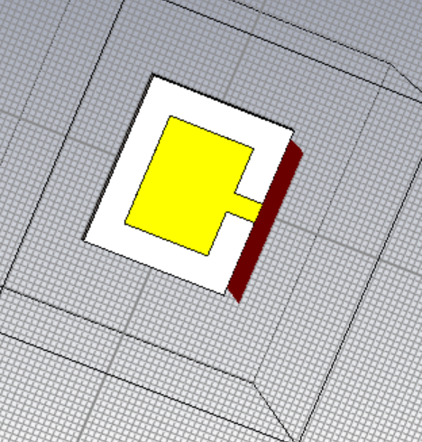
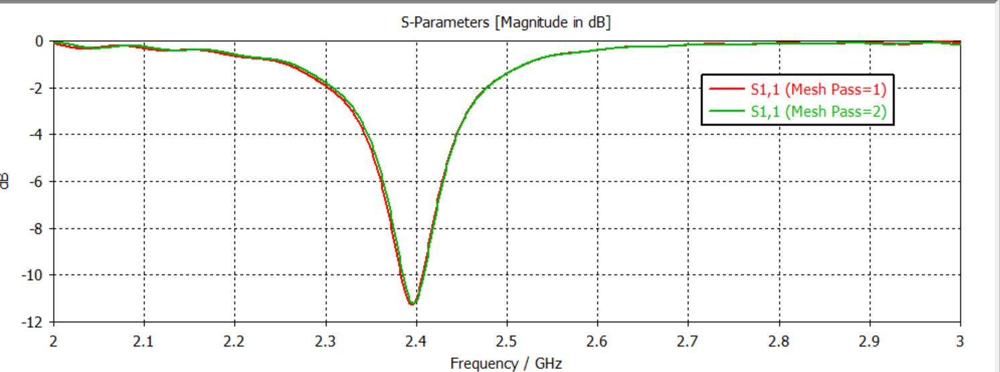
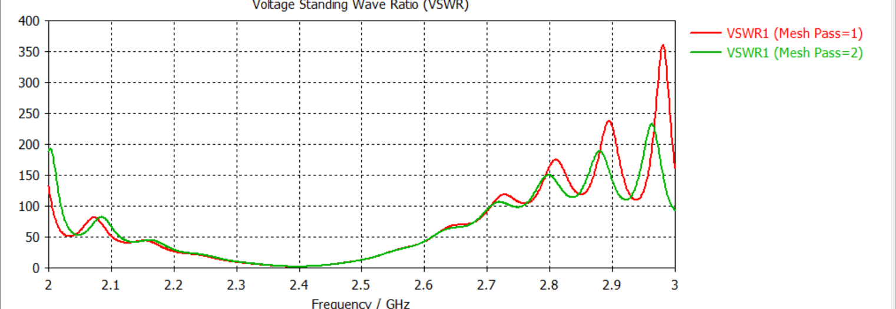

# Microstrip Patch Antenna Design (Line / Inset-Fed) - 2.4 GHz

Design and electromagnetic simulation of an inset line-fed microstrip patch antenna targeting the **2.4 GHz ISM band** using **CST Studio Suite**.

---

## 📡 Antenna Geometry & Structure

The microstrip patch antenna is fed by a microstrip feedline with inset notches designed for $50\,\Omega$ impedance matching.

---

## 📊 Simulation & Results

The antenna was analyzed across mesh refinement passes (`Mesh Pass = 1` and `Mesh Pass = 2`) to ensure convergence and numerical stability.

### 1. Return Loss ($S_{11}$)
- **Resonant Frequency:** $2.4\text{ GHz}$ (ISM Band)
- **Achieved Return Loss ($S_{11}$):** $\mathbf{-11.3\text{ dB}}$ at $2.4\text{ GHz}$

### 2. Voltage Standing Wave Ratio (VSWR)
- **VSWR at Resonance:** $\approx \mathbf{1.75}$ at $2.4\text{ GHz}$ (well within the standard $\le 2:1$ operational specification)

---

## 📁 Repository Files

- `geometry.png` : 3D CAD perspective of the line-fed patch in CST
- `s11_plot.png` : Converged S11 reflection coefficient vs. frequency
- `vswr_plot.png` : VSWR characteristic curve across 2–3 GHz
- `README.md` : Project documentation

---
**Tool:** CST Studio Suite  
**Author:** Bollam Rakesh Balaji (NIT Mizoram)